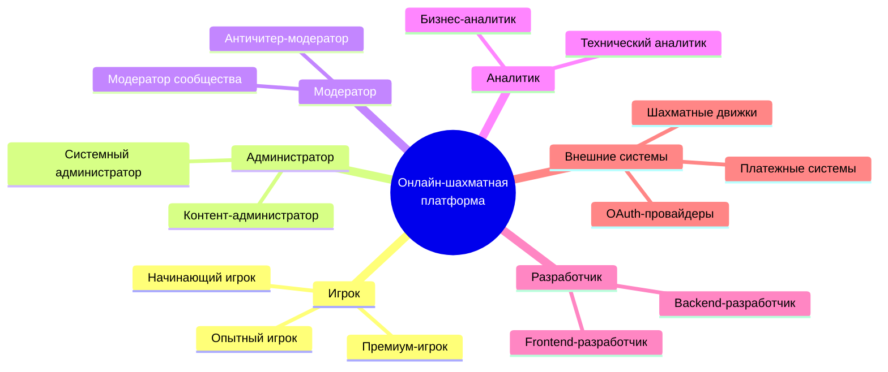
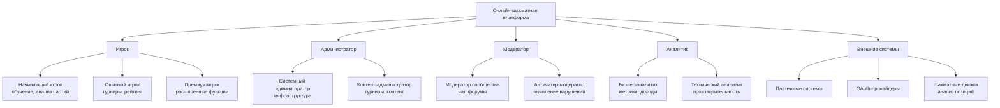
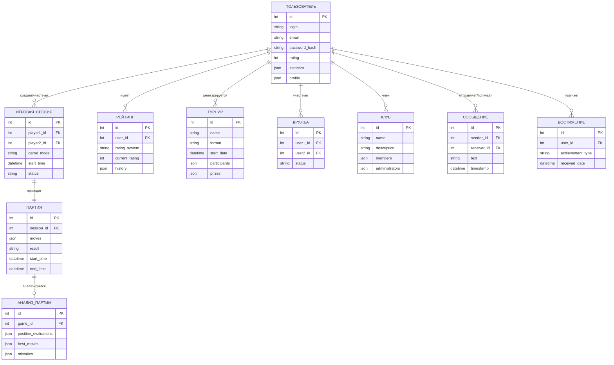
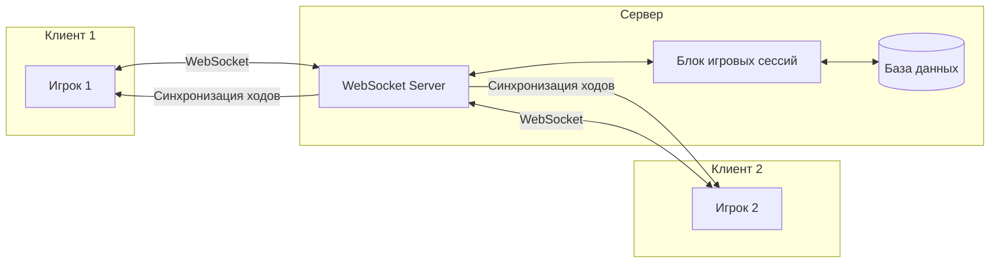

# Практическая работа №2

**по дисциплине «Проектирование информационных систем»**

**на тему «Разработка требований к информационной системе»**

студента 3 курса группы ПИ-б-о-231(1)  
[ФИО студента]

**Направления подготовки:** 09.03.04 «Программная инженерия»

---

**МИНИСТЕРСТВО НАУКИ И ВЫСШЕГО ОБРАЗОВАНИЯ РОССИЙСКОЙ ФЕДЕРАЦИИ**

Федеральное государственное автономное образовательное учреждение высшего образования  
«КРЫМСКИЙ ФЕДЕРАЛЬНЫЙ УНИВЕРСИТЕТ им. В. И. ВЕРНАДСКОГО»  
ФИЗИКО-ТЕХНИЧЕСКИЙ ИНСТИТУТ  
Кафедра компьютерной инженерии и моделирования

---

**Симферополь, 2025**

---

## ВВЕДЕНИЕ

Разработка информационной системы онлайн-шахматной платформы направлена на автоматизацию ключевых процессов онлайн-игры в шахматы: проведение партий между пользователями в реальном времени, организация турниров, ведение рейтингов и статистики игроков, анализ партий и обучение. В работе применяется метод VORD для анализа требований, строится информационная модель и формируется техническое задание по ГОСТ 34.602. Проект реализуется на платформе Python (FastAPI) / Node.js (NestJS) с использованием PostgreSQL и Redis, что обеспечивает масштабируемость и надежность системы для работы с большим количеством одновременных пользователей.

## ЦЕЛЬ РАБОТЫ

Целью данной работы является проектирование и анализ информационной системы онлайн-шахматной платформы с использованием методологии VORD. В рамках работы предусмотрено:

- изучение теоретического материала по разработке требований;
- построение опорных точек зрения методом VORD;
- создание информационной модели системы;
- формирование пользовательских и системных требований;
- проведение аттестации требований;
- разработка технического задания согласно ГОСТ 34.602;
- построение многоуровневой модели системы с описанием функциональных компонентов.

### Программные средства

- **Среда разработки:** PyCharm, WebStorm, VS Code
- **Язык программирования:** Python, JavaScript/TypeScript
- **Фреймворк:** FastAPI (Python) или NestJS (Node.js)
- **База данных:** PostgreSQL, Redis
- **Фронтенд-технологии:** React, TypeScript, HTML, CSS, JavaScript
- **Система контроля версий:** Git (GitLab/GitHub)
- **Инструмент моделирования:** draw.io (для создания диаграмм VORD)
- **DevOps:** Docker, Docker Compose, Nginx

---

## 1. Построение опорных точек зрения на основании метода VORD для формирования и анализа требований

Метод VORD (Viewpoint-Oriented Requirements Definition) позволяет систематически выявить и структурировать требования различных заинтересованных сторон (стейкхолдеров) системы онлайн-шахматной платформы.

### 1.1. Диаграмма идентификации точек зрения

Основные точки зрения (стейкхолдеры):

- **Игрок** — основной пользователь платформы, играющий в шахматы
- **Администратор** — управляет системой, модерация, управление пользователями
- **Модератор** — контролирует соблюдение правил, выявляет нарушения
- **Аналитик** — анализирует статистику, загрузку системы, эффективность
- **Разработчик** — поддерживает и развивает систему
- **Внешние системы** — платежные шлюзы, OAuth-провайдеры, шахматные движки

### 1.2. Диаграмма иерархии точек зрения

---

## 2. Информационная модель системы

Основные объекты системы:

- **Пользователь** (логин, email, пароль, рейтинг, статистика, профиль)
- **Игровая сессия** (идентификатор, игроки, режим игры, время, статус)
- **Партия** (идентификатор, сессия, ходы, результат, время начала/окончания)
- **Турнир** (название, формат, дата начала, участники, призы)
- **Рейтинг** (пользователь, система рейтинга, текущий рейтинг, история изменений)
- **Анализ партии** (партия, оценка позиций, лучшие ходы, ошибки)
- **Дружба** (пользователь1, пользователь2, статус)
- **Клуб** (название, описание, участники, администраторы)
- **Сообщение** (отправитель, получатель, текст, время)
- **Достижение** (пользователь, тип достижения, дата получения)

Взаимодействия:

- Пользователь - Игровая сессия (создание/участие)
- Игровая сессия - Партия (проведение партии)
- Пользователь - Рейтинг (обновление после партии)
- Пользователь - Турнир (регистрация/участие)
- Партия - Анализ партии (автоматический анализ)
- Пользователь - Дружба (добавление в друзья)
- Пользователь - Клуб (членство)
- Пользователь - Сообщение (отправка/получение)
- Пользователь - Достижение (получение наград)

Диаграмма информационной модели (ER-диаграмма):

Требования пользователя

Для игроков:

- Регистрация и авторизация в системе
- Поиск соперников по рейтингу и режиму игры
- Проведение онлайн-партий в реальном времени
- Просмотр истории сыгранных партий
- Анализ своих партий с подсказками и оценками
- Участие в турнирах различных форматов
- Просмотр рейтинга и статистики
- Общение с другими игроками (чат, друзья)
- Создание и участие в клубах
- Получение достижений и наград
- Настройка профиля (аватар, биография)
- Электронная регистрация на турниры

Для администраторов:

- Управление пользователями (блокировка, модерация)
- Создание и управление турнирами
- Мониторинг активности системы
- Просмотр логов и отчетов
- Управление контентом платформы
- Настройка системных параметров

Для модераторов:

- Выявление и блокировка читеров
- Модерация чатов и сообщений
- Рассмотрение жалоб пользователей
- Контроль соблюдения правил платформы

Для аналитиков:

- Анализ активности пользователей
- Статистика по турнирам и партиям
- Отчеты по загрузке системы
- Анализ эффективности функций платформы
- Прогнозирование роста пользовательской базы

Системные требования

Функциональные:

1. Хранение данных о пользователях, партиях, турнирах, рейтингах
2. Проведение игровых сессий в реальном времени через WebSocket
3. Система матчмейкинга для поиска соперников
4. Вычисление и обновление рейтингов (Elo/Glicko)
5. Автоматическая организация турниров
6. Интеграция с шахматными движками для анализа партий
7. Система уведомлений пользователей
8. Резервное копирование данных
9. Авторизация и аутентификация пользователей (OAuth, JWT)
10. Система античитинга и модерации
11. Формирование аналитических отчетов
12. Интеграция с платежными системами (для премиум-функций)

Нефункциональные:

1. Время отклика системы ≤ 100 мс для игровых действий
2. Поддержка 1000+ одновременных игровых сессий
3. Круглосуточная доступность (uptime 99.9%)
4. Защита персональных данных пользователей (GDPR compliance)
5. Масштабируемость для будущего расширения
6. Совместимость с современными браузерами (Chrome, Firefox, Safari, Edge)
7. Адаптивный дизайн для мобильных устройств
8. Низкая задержка (latency) для real-time взаимодействия
9. Отказоустойчивость и автоматическое восстановление
10. Мониторинг производительности и логирование

Технические:

- Backend: Python (FastAPI) или Node.js (NestJS)
- База данных: PostgreSQL (основная), Redis (кеш и очереди)
- Frontend: React, TypeScript, HTML5, CSS3
- Real-time: WebSocket (Socket.io или аналоги)
- Безопасность: HTTPS, JWT токены, шифрование данных
- Инфраструктура: Docker, Docker Compose, Nginx
- CI/CD: GitLab CI/CD или GitHub Actions
- Мониторинг: Prometheus, Grafana, ELK Stack

---

## 3. Аттестация требований, типы проверок

Аттестация требований к информационной системе онлайн-шахматной платформы подтвердила их полную готовность к переходу на этап проектирования. Все требования прошли комплексную проверку и продемонстрировали соответствие ожиданиям заказчика и реальным возможностям реализации в установленные сроки (8 месяцев).

В процессе аттестации была проведена многоуровневая проверка требований, которая включала анализ их правильности, непротиворечивости, полноты и выполнимости. Результаты показали, что сформулированные требования полностью охватывают необходимый функционал системы и не содержат противоречий между различными аспектами системы.

Для проверки правильности требований был проведен детальный анализ с участием ключевых стейкхолдеров, включая представителей целевой аудитории (игроков разного уровня), администраторов платформы и технических специалистов. В ходе обсуждений подтвердилось, что требования адекватно отражают все необходимые функции системы - от базового проведения партий в реальном времени до сложной аналитики и организации турниров.

Проверка на непротиворечивость показала, что все функциональные и нефункциональные требования гармонично сочетаются друг с другом. Технические требования к производительности (время отклика до 100 мс, поддержка 1000+ одновременных сессий) полностью соответствуют заявленному функционалу real-time игры и возможностям выбранной технологической платформы на основе FastAPI/NestJS, PostgreSQL и Redis.

Полнота требований была подтверждена через детальное сопоставление с бизнес-процессами онлайн-шахматной платформы. Спецификация охватывает все ключевые аспекты работы системы: проведение игровых сессий, управление рейтингами, организацию турниров, анализ партий, социальные функции, администрирование и модерацию.

Проверка выполнимости

Проверка выполнимости требований показала, что выбранный технологический стек и архитектурные решения позволяют реализовать всю заявленную функциональность в установленные сроки (8 месяцев) и в рамках утвержденного бюджета (8 млн рублей). Особое внимание было уделено анализу требований к real-time взаимодействию, интеграции с внешними системами (шахматные движки, платежные шлюзы) и обеспечению безопасности данных.

В процессе аттестации использовались современные методы валидации, включая интерактивное прототипирование интерфейсов, разработку тестовых сценариев для всех ключевых функций системы (создание партии, проведение хода, завершение партии, регистрация на турнир), а также автоматизированную проверку непротиворечивости требований с помощью специализированного программного обеспечения.

По результатам комплексной проверки требования к системе онлайн-шахматной платформы признаны полностью готовыми к использованию в качестве основы для проектирования архитектуры системы и последующей реализации проекта. Все выявленные в процессе предварительного анализа вопросы были успешно разрешены, и текущая версия требований не содержит противоречий или неясностей.

---

## 4. Техническое задание на создание программного обеспечения

1. ОБЩИЕ СВЕДЕНИЯ

- Наименование: Информационная система онлайн-шахматной платформы (ИСОШП)
- Шифр: ИСОШП-2025
- Заказчик: [Наименование заказчика]
- Разработчик: [ФИО разработчика]
- Срок разработки: 8 месяцев (Сентябрь 2025 – Апрель 2026)

2. ЦЕЛИ И НАЗНАЧЕНИЕ СОЗДАНИЯ

Цели:

- Автоматизация процессов проведения онлайн-шахматных партий
- Создание удобной платформы для игры в шахматы в реальном времени
- Организация турниров и соревнований
- Развитие шахматного сообщества через социальные функции
- Предоставление инструментов для обучения и анализа партий

Назначение:

- Проведение онлайн-партий между пользователями в реальном времени
- Управление рейтингами и статистикой игроков
- Автоматизация организации турниров различных форматов
- Анализ партий с использованием шахматных движков
- Социальное взаимодействие между игроками

3. ХАРАКТЕРИСТИКА ОБЪЕКТОВ АВТОМАТИЗАЦИИ

Основные объекты:

- Пользователи (игроки, администраторы, модераторы)
- Игровые сессии (режимы игры, время, соперники)
- Партии (ходы, результаты, анализ)
- Турниры (форматы, участники, призы)
- Рейтинги (системы Elo/Glicko, история изменений)
- Клубы и сообщества
- Достижения и награды

Бизнес-процессы, подлежащие автоматизации:

- Создание и проведение игровых сессий
- Система матчмейкинга для поиска соперников
- Вычисление и обновление рейтингов
- Организация и проведение турниров
- Анализ партий и предоставление рекомендаций
- Модерация и контроль соблюдения правил

4. ТРЕБОВАНИЯ К АВТОМАТИЗИРОВАННОЙ СИСТЕМЕ

4.1. Требования к функциям:

- Управление пользователями и профилями
- Проведение игровых сессий в реальном времени
- Система матчмейкинга
- Управление рейтингами и статистикой
- Организация турниров
- Анализ партий
- Социальные функции (друзья, клубы, чат)
- Администрирование и модерация
- Формирование отчетности и аналитики

4.2. Требования к надежности:

- Время отклика не более 100 мс для игровых действий
- Доступность 99.9% в рабочее время
- Резервное копирование данных ежедневно
- Автоматическое восстановление после сбоев

4.3. Технические требования:

- Серверная часть: Python (FastAPI) или Node.js (NestJS)
- База данных: PostgreSQL (основная), Redis (кеш)
- Клиентская часть: React, TypeScript, HTML5, CSS3
- Real-time: WebSocket (Socket.io)
- Сервер ОС: Linux Ubuntu Server 22.04 LTS
- Контейнеризация: Docker, Docker Compose
- Веб-сервер: Nginx

5. СОСТАВ И СОДЕРЖАНИЕ РАБОТ ПО СОЗДАНИЮ

Этапы разработки:

1. Проектирование архитектуры системы (1.5 месяца)
2. Разработка backend-компонентов (3 месяца)
3. Разработка пользовательского интерфейса (2 месяца)
4. Интеграция real-time компонентов (1 месяц)
5. Комплексное тестирование (1.5 месяца)
6. Ввод в промышленную эксплуатацию (1 месяц)

6. ПОРЯДОК РАЗРАБОТКИ

- Итеративная разработка по методологии Agile
- Еженедельные встречи с заказчиком
- Поэтапная приемка компонентов системы
- Документирование по ходу разработки
- Использование системы контроля версий Git

7. ПОРЯДОК КОНТРОЛЯ И ПРИЕМКИ

Виды испытаний:

- Функциональное тестирование
- Нагрузочное тестирование (1000+ одновременных сессий)
- Тестирование real-time взаимодействия
- Тестирование безопасности
- Приемо-сдаточные испытания

Критерии приемки:

- Соответствие требованиям ТЗ
- Отсутствие критических ошибок
- Полнота документации
- Обучение персонала заказчика
- Успешное прохождение нагрузочных тестов

8. ТРЕБОВАНИЯ К ПОДГОТОВКЕ ОБЪЕКТА

- Подготовка серверной инфраструктуры
- Настройка сетевого оборудования
- Установка и настройка СУБД (PostgreSQL, Redis)
- Подготовка рабочих мест пользователей
- Обучение администраторов системы
- Настройка системы мониторинга

9. ТРЕБОВАНИЯ К ДОКУМЕНТИРОВАНИЮ

Перечень документации:

- Технический проект системы
- Руководство администратора
- Руководство пользователя
- Программа и методика испытаний
- Отчет о проведении испытаний
- API документация

10. ИСТОЧНИКИ РАЗРАБОТКИ

- ГОСТ 34.602-2020
- Анализ предметной области онлайн-шахматных платформ
- Изучение существующих аналогов (lichess.org, chess.com)
- Требования и пожелания заказчика
- Результаты обследования бизнес-процессов

---

## 5. Отчёт, включающий все полученные уровни модели, описание функциональных блоков, потоков данных, хранилищ и внешних объектов

Разработанная модель информационной системы онлайн-шахматной платформы включает несколько взаимосвязанных уровней, описывающих все аспекты функционирования системы.

На концептуальном уровне система представляет собой централизованный комплекс управления онлайн-шахматной платформой, взаимодействующий с ключевыми внешними объектами: игроками различных уровней, администраторами, модераторами, аналитиками и внешними системами (платежными шлюзами, OAuth-провайдерами, шахматными движками). Основной поток данных включает получение запросов на создание игровых сессий, проведение ходов в реальном времени, регистрацию на турниры, обработку этих запросов и предоставление результатов пользователям через WebSocket соединения.

Функциональная архитектура системы состоит из семи основных блоков:

```mermaid
graph TB
    subgraph "Функциональные блоки системы"
        A[Блок управления<br/>игровыми сессиями]
        B[Блок матчмейкинга]
        C[Блок управления<br/>рейтингами и статистикой]
        D[Блок организации турниров]
        E[Блок анализа партий]
        F[Блок социальных функций]
        G[Блок администрирования<br/>и модерации]
    end
    
    subgraph "Хранилища данных"
        H1[Хранилище пользователей]
        H2[Хранилище игровых сессий]
        H3[Хранилище партий]
        H4[Хранилище турниров]
        H5[Хранилище рейтингов]
        H6[Хранилище анализа партий]
        H7[Хранилище социальных связей]
        H8[Хранилище достижений]
        H9[Хранилище модерации]
        H10[Хранилище системных логов]
    end
    
    subgraph "Внешние системы"
        EXT1[Платежные системы]
        EXT2[OAuth-провайдеры]
        EXT3[Шахматные движки]
    end
    
    A <--> H2
    A <--> H3
    B <--> H1
    B --> A
    C <--> H5
    C <--> H3
    D <--> H4
    D <--> H1
    E <--> H6
    E <--> H3
    E <--> EXT3
    F <--> H7
    F <--> H8
    G <--> H9
    G <--> H10
    
    A <--> H1
    F <--> H1
    D <--> H1
```

**Описание функциональных блоков:**

1. **Блок управления игровыми сессиями** — отвечает за создание и управление игровыми комнатами, обработку ходов в реальном времени, синхронизацию состояния игры между клиентами, контроль времени и завершение партий.

2. **Блок матчмейкинга** — обеспечивает поиск подходящих соперников на основе рейтинга, режима игры и предпочтений пользователя, управление очередями ожидания и автоматическое создание игровых сессий.

3. **Блок управления рейтингами и статистикой** — обрабатывает результаты партий, вычисляет изменения рейтинга по системам Elo или Glicko, обновляет статистику игроков и формирует рейтинговые таблицы.

4. **Блок организации турниров** — управляет жизненным циклом турниров, регистрацией участников, автоматическим формированием сеток, проведением раундов и начислением призов.

5. **Блок анализа партий** — интегрируется с шахматными движками для оценки позиций, выявления лучших ходов и ошибок, предоставления рекомендаций по улучшению игры.

6. **Блок социальных функций** — обеспечивает управление друзьями, создание и участие в клубах, обмен сообщениями между пользователями, систему достижений и наград.

7. **Блок администрирования и модерации** — предоставляет инструменты для управления пользователями, мониторинга активности, выявления читеров, модерации контента и формирования отчетов.

Информационная модель системы основана на десяти основных хранилищах данных:

- **Хранилище пользователей** — содержит профили игроков, учетные данные, настройки и предпочтения
- **Хранилище игровых сессий** — включает активные и завершенные игровые комнаты, состояние партий, таймеры
- **Хранилище партий** — содержит полную историю всех сыгранных партий с последовательностью ходов, результатами и метаданными
- **Хранилище турниров** — описывает текущие и завершенные турниры, участников, сетки и результаты
- **Хранилище рейтингов** — содержит текущие рейтинги игроков по различным системам и историю изменений
- **Хранилище анализа партий** — включает результаты автоматического анализа позиций, оценки и рекомендации
- **Хранилище социальных связей** — содержит информацию о дружбе между пользователями, членстве в клубах, сообщениях
- **Хранилище достижений** — описывает полученные награды и прогресс пользователей
- **Хранилище модерации** — содержит записи о нарушениях, блокировках, жалобах
- **Хранилище системных логов** — включает записи о всех действиях пользователей и системных событиях для аудита и отладки

Потоки данных в системе организованы по принципу непрерывного обмена между функциональными блоками и хранилищами. Real-time потоки через WebSocket обеспечивают мгновенную синхронизацию игровых состояний между клиентами, обновление таймеров и уведомления о событиях.

**Описание потоков данных:**

1. **Real-time потоки через WebSocket** — обеспечивают мгновенную синхронизацию игровых состояний между клиентами, обновление таймеров и уведомления о событиях.

2. **Оперативные данные о ходах** — немедленно обрабатываются блоком игровых сессий и сохраняются в хранилище партий.

3. **Результаты партий** — автоматически передаются в блок управления рейтингами для пересчета, а изменения рейтинга отражаются в профилях пользователей.

4. **Регистрации на турниры** — обрабатываются блоком организации турниров, который обновляет хранилище турниров и уведомляет участников.

5. **Запросы на анализ партий** — направляются в блок анализа, который взаимодействует с внешними шахматными движками и сохраняет результаты в соответствующем хранилище.

6. **Социальные взаимодействия** — (дружба, сообщения, клубы) обрабатываются соответствующим блоком и синхронизируются между пользователями в реальном времени.

Все компоненты системы взаимодействуют через единый интерфейсный слой, обеспечивающий согласованность данных и целостность бизнес-процессов. Модель демонстрирует высокую степень интеграции компонентов и эффективную организацию потоков информации, что позволяет системе обеспечивать надежное проведение игровых сессий в реальном времени, автоматизацию турниров, точный расчет рейтингов и предоставление аналитических инструментов для развития игроков.

---

## ЗАКЛЮЧЕНИЕ

В ходе работы спроектирована информационная система онлайн-шахматной платформы. Построены диаграммы VORD, разработана информационная модель и сформулированы требования. Создано техническое задание по ГОСТ 34.602. Архитектура системы включает модули управления игровыми сессиями, матчмейкинга, рейтингов, турниров, анализа партий, социальных функций и администрирования. Технологический стек: Python (FastAPI) / Node.js (NestJS), PostgreSQL, Redis, React, TypeScript, WebSocket. Система обеспечивает проведение партий в реальном времени, автоматизацию турниров, точный расчет рейтингов, анализ партий и социальное взаимодействие. Все компоненты интегрированы в единую структуру с четкими потоками данных через WebSocket для real-time взаимодействия и REST API для стандартных операций.

---

## СПИСОК ИСПОЛЬЗУЕМОЙ ЛИТЕРАТУРЫ

1. Метод VORD (Viewpoint-Oriented Requirements Definition) – учебные материалы по проектированию информационных систем [Электронный ресурс]. – URL: https://tut-files.ru/previewfile/151043/2

2. Методологии разработки требований к программному обеспечению [Электронный ресурс]. – URL: https://studfile.net/preview/4327359/page:3/

3. ГОСТ 34.602-2020. Информационная технология (ИТ). Комплекс стандартов на автоматизированные системы. Техническое задание на создание автоматизированной системы [Электронный ресурс]. – URL: https://www.swrit.ru/doc/gost34/34.602-2020.pdf

4. Официальная документация по FastAPI [Электронный ресурс]. – URL: https://fastapi.tiangolo.com/

5. Официальная документация по NestJS [Электронный ресурс]. – URL: https://docs.nestjs.com/

6. Документация по React [Электронный ресурс]. – URL: https://react.dev/

7. Руководство по PostgreSQL [Электронный ресурс]. – URL: https://www.postgresql.org/docs/

8. Документация по Redis [Электронный ресурс]. – URL: https://redis.io/docs/

9. WebSocket API документация [Электронный ресурс]. – URL: https://developer.mozilla.org/en-US/docs/Web/API/WebSocket

10. Волк, В.К. Практическое введение в программную инженерию : учебное пособие / В.К. Волк. — Санкт-Петербург : Лань, 2019. — 100 с.

