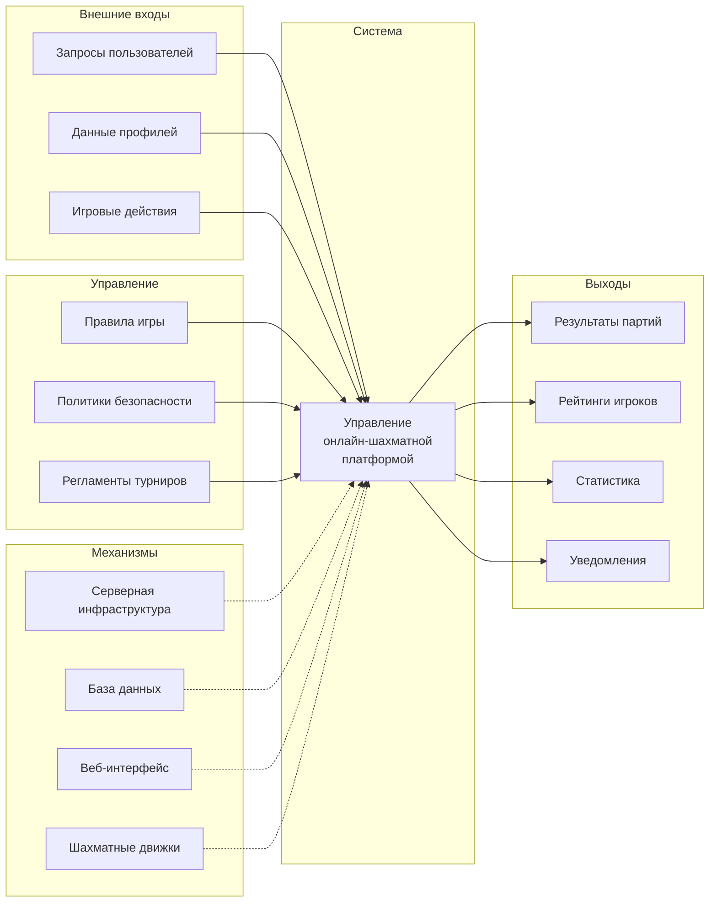
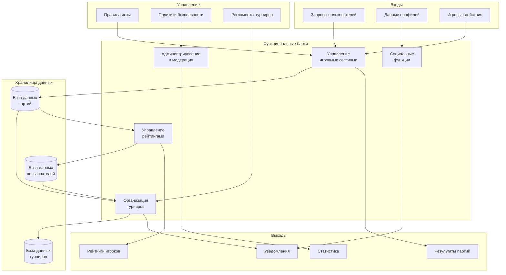
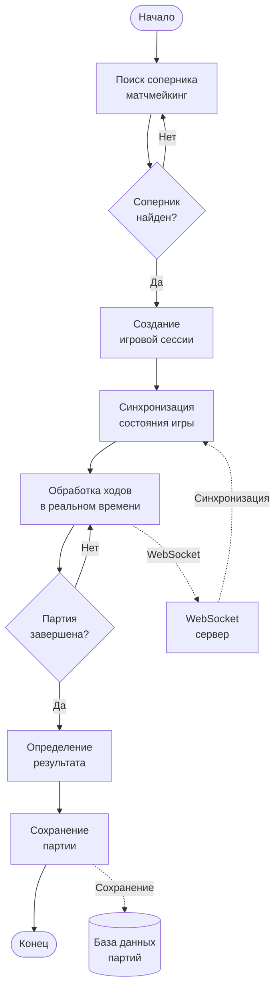
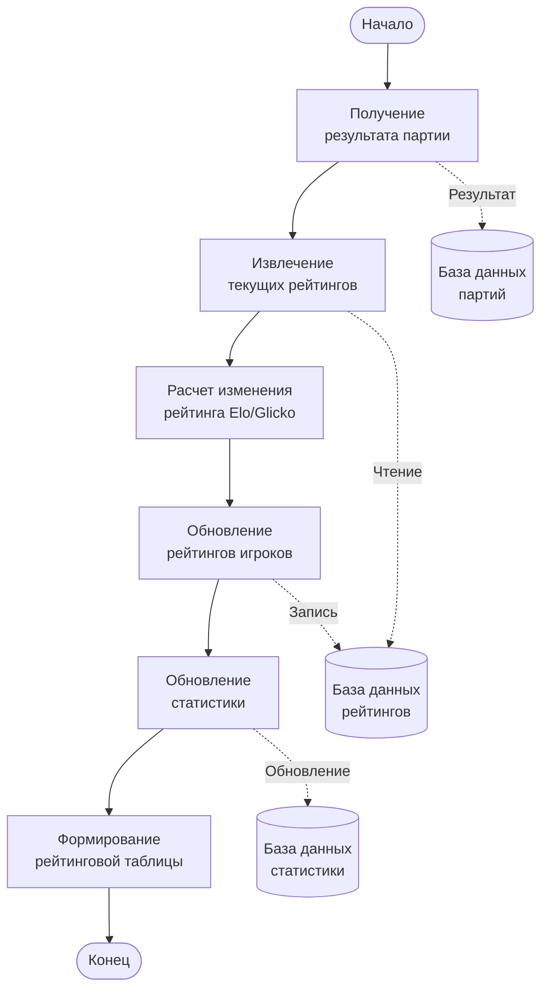
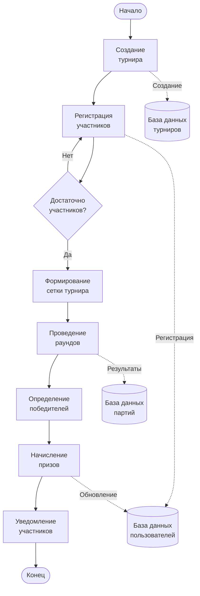
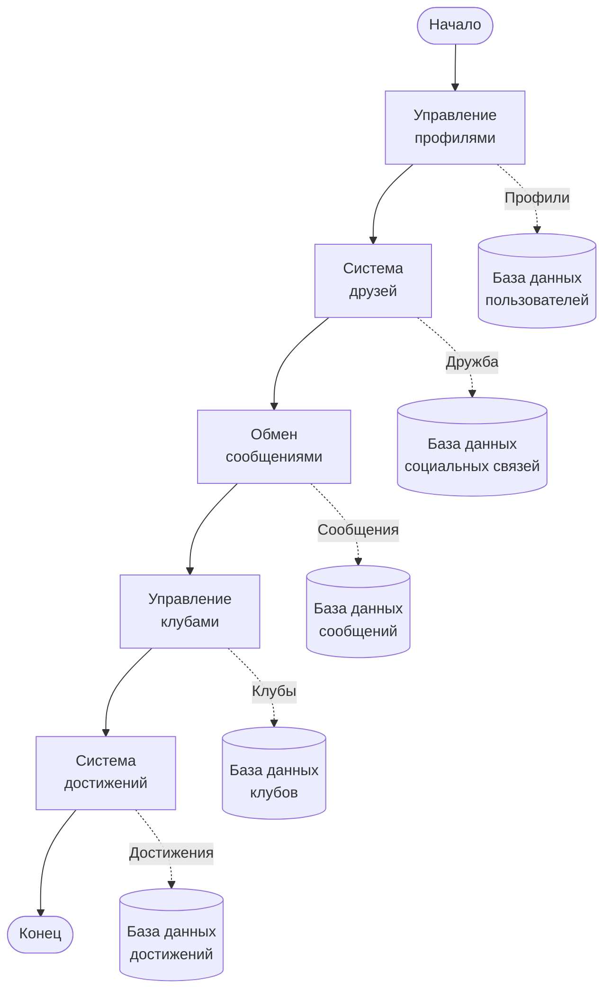
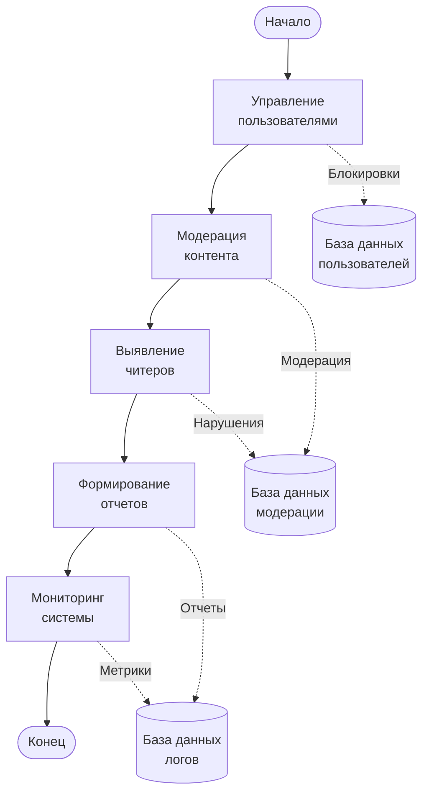

# Практическая работа №3

**по дисциплине «Проектирование информационных систем»**

**на тему «Методология функционального моделирования»**

студента 3 курса группы ПИ-б-о-231(1)  
[ФИО студента]

**Направления подготовки:** 09.03.04 «Программная инженерия»

---

**МИНИСТЕРСТВО НАУКИ И ВЫСШЕГО ОБРАЗОВАНИЯ РОССИЙСКОЙ ФЕДЕРАЦИИ**

Федеральное государственное автономное образовательное учреждение высшего образования  
«КРЫМСКИЙ ФЕДЕРАЛЬНЫЙ УНИВЕРСИТЕТ им. В. И. ВЕРНАДСКОГО»  
ФИЗИКО-ТЕХНИЧЕСКИЙ ИНСТИТУТ  
Кафедра компьютерной инженерии и моделирования

---

**Симферополь, 2025**

---

## ВВЕДЕНИЕ

Функциональное моделирование является важным этапом проектирования информационных систем, позволяющим структурировать и описать бизнес-процессы системы. В данной работе применяются методологии IDEF0 и IDEF3 для построения функциональной модели информационной системы онлайн-шахматной платформы, описанной в первой практической работе. Методология IDEF0 используется для создания контекстной диаграммы и диаграммы первого уровня, отражающей основные функциональные блоки системы. Методология IDEF3 применяется для детальной декомпозиции процессов на последующих уровнях, описывающей последовательность выполнения операций и потоки данных между ними.

## ЦЕЛЬ РАБОТЫ

Целью данной работы является изучение методологий функционального моделирования IDEF0 и IDEF3 и их применение для построения функциональной модели информационной системы онлайн-шахматной платформы. В рамках работы предусмотрено:

- изучение теоретического материала по методологиям IDEF0 и IDEF3;
- построение контекстной диаграммы системы методом IDEF0;
- построение диаграммы первого уровня (A0) с не менее чем 4 функциональными блоками;
- декомпозиция функциональных блоков методом IDEF3 на 2-3 уровня вглубь;
- описание функциональных блоков, потоков данных, хранилищ и внешних объектов.

### Программные средства

- **Инструмент моделирования:** draw.io, Bizagi Modeler, или специализированные инструменты для IDEF (BPwin, AllFusion Process Modeler)
- **Альтернатива:** Mermaid для визуализации диаграмм в Markdown
- **Среда разработки:** VS Code, любой текстовый редактор для Markdown

---

## 1. Теоретические сведения

### 1.1. Методология IDEF0

IDEF0 (Integrated Definition Function Modeling) — методология функционального моделирования, основанная на графическом представлении бизнес-функций в виде блоков. Каждый функциональный блок имеет четыре стороны:

- **Вход (Input)** — левая сторона — данные или материалы, которые преобразуются функцией
- **Выход (Output)** — правая сторона — результаты выполнения функции
- **Управление (Control)** — верхняя сторона — правила, стандарты, политики, управляющие выполнением функции
- **Механизм (Mechanism)** — нижняя сторона — ресурсы, необходимые для выполнения функции (люди, оборудование, системы)

### 1.2. Методология IDEF3

IDEF3 (Process Description Capture Method) — методология описания процессов, фокусирующаяся на последовательности выполнения операций и потоках данных между ними. IDEF3 позволяет описать:

- Последовательность выполнения операций
- Ветвления и слияния процессов
- Временные зависимости
- Условия выполнения операций

### 1.3. Принципы моделирования

- **Принцип функциональной декомпозиции** — сложные функции разбиваются на более простые
- **Принцип ограничения сложности** — на диаграмме должно быть от 2 до 6 блоков
- **Принцип контекста** — моделирование начинается с контекстной диаграммы, определяющей границы системы

---

## 2. Функциональная модель системы онлайн-шахматной платформы

### 2.1. Контекстная диаграмма (IDEF0)

Контекстная диаграмма представляет систему как единый функциональный блок "Управление онлайн-шахматной платформой" и определяет её взаимодействие с внешней средой.

**Описание контекстной диаграммы:**

- **Входы:**
  - Запросы пользователей (поиск соперников, регистрация на турниры, запросы на анализ партий)
  - Данные профилей (регистрация, обновление профиля)
  - Игровые действия (ходы, завершение партий)

- **Управление:**
  - Правила игры (шахматные правила, контроль времени)
  - Политики безопасности (аутентификация, модерация)
  - Регламенты турниров (форматы, расписание)

- **Выходы:**
  - Результаты партий (история, анализ)
  - Рейтинги игроков (обновленные рейтинги, статистика)
  - Статистика (отчеты, аналитика)
  - Уведомления (о событиях, турнирах)

- **Механизмы:**
  - Серверная инфраструктура (FastAPI/NestJS, WebSocket)
  - База данных (PostgreSQL, Redis)
  - Веб-интерфейс (React, TypeScript)
  - Шахматные движки (для анализа позиций)

### 2.2. Диаграмма первого уровня (A0) — модель окружения

Диаграмма A0 декомпозирует главную функцию на основные функциональные блоки системы.

**Описание функциональных блоков диаграммы A0:**

1. **A1: Управление игровыми сессиями**
   - Входы: Запросы на создание партии, игровые действия (ходы)
   - Управление: Правила игры, контроль времени
   - Выходы: Результаты партий, состояние игры
   - Механизмы: WebSocket сервер, игровая логика

2. **A2: Управление рейтингами**
   - Входы: Результаты партий
   - Управление: Системы рейтингов (Elo/Glicko)
   - Выходы: Обновленные рейтинги игроков
   - Механизмы: Алгоритмы расчета рейтинга, база данных

3. **A3: Организация турниров**
   - Входы: Запросы на регистрацию в турниры
   - Управление: Регламенты турниров, форматы
   - Выходы: Уведомления о турнирах, результаты
   - Механизмы: Система управления турнирами, база данных

4. **A4: Социальные функции**
   - Входы: Данные профилей, запросы на дружбу, сообщения
   - Управление: Политики безопасности
   - Выходы: Уведомления, обновления профилей
   - Механизмы: Система друзей, чат, клубы

5. **A5: Администрирование и модерация**
   - Входы: Запросы администраторов, жалобы
   - Управление: Политики безопасности, правила модерации
   - Выходы: Статистика, отчеты, блокировки
   - Механизмы: Панель администратора, система логирования

---

## 3. Декомпозиция функциональных блоков (IDEF3)

### 3.1. Декомпозиция блока A1: Управление игровыми сессиями

**Описание процессов:**

- **A11: Поиск соперника (матчмейкинг)** — система подбирает соперника на основе рейтинга и предпочтений
- **A13: Создание игровой сессии** — инициализация игровой комнаты, настройка таймеров
- **A14: Синхронизация состояния игры** — обновление позиции на доске для обоих игроков
- **A15: Обработка ходов в реальном времени** — валидация и применение ходов через WebSocket
- **A17: Определение результата** — проверка условий окончания партии (мат, пат, ничья, сдача)
- **A18: Сохранение партии** — запись полной истории партии в базу данных

### 3.2. Декомпозиция блока A2: Управление рейтингами

**Описание процессов:**

- **A21: Получение результата партии** — извлечение информации о завершенной партии
- **A22: Извлечение текущих рейтингов** — получение рейтингов обоих игроков
- **A23: Расчет изменения рейтинга** — применение алгоритма Elo или Glicko для расчета нового рейтинга
- **A24: Обновление рейтингов игроков** — сохранение новых значений рейтинга
- **A25: Обновление статистики** — обновление счетчиков побед, поражений, ничьих
- **A26: Формирование рейтинговой таблицы** — генерация актуального рейтинга для отображения

### 3.3. Декомпозиция блока A3: Организация турниров

**Описание процессов:**

- **A31: Создание турнира** — администратор создает турнир с указанием формата, даты, призов
- **A32: Регистрация участников** — игроки регистрируются на турнир
- **A34: Формирование сетки турнира** — автоматическое создание пар для первого раунда
- **A35: Проведение раундов** — организация партий между участниками согласно сетке
- **A36: Определение победителей** — выявление победителей каждого раунда и финала
- **A37: Начисление призов** — обновление рейтингов, выдача достижений победителям
- **A38: Уведомление участников** — отправка уведомлений о результатах турнира

### 3.4. Декомпозиция блока A4: Социальные функции

**Описание процессов:**

- **A41: Управление профилями** — создание, редактирование профилей пользователей
- **A42: Система друзей** — добавление в друзья, управление списком друзей
- **A43: Обмен сообщениями** — отправка и получение личных сообщений
- **A44: Управление клубами** — создание клубов, участие в клубах
- **A45: Система достижений** — получение и отображение достижений игроков

### 3.5. Декомпозиция блока A5: Администрирование и модерация

**Описание процессов:**

- **A51: Управление пользователями** — блокировка, разблокировка, изменение прав доступа
- **A52: Модерация контента** — проверка сообщений, чатов, профилей на нарушения
- **A53: Выявление читеров** — анализ игровых данных для обнаружения нечестной игры
- **A54: Формирование отчетов** — создание статистических отчетов о работе системы
- **A55: Мониторинг системы** — отслеживание производительности, загрузки, ошибок

---

## 4. Описание потоков данных, хранилищ и внешних объектов

### 4.1. Хранилища данных

1. **База данных пользователей** — хранит профили, учетные данные, настройки пользователей
2. **База данных партий** — содержит полную историю всех сыгранных партий с ходами
3. **База данных турниров** — информация о турнирах, участниках, результатах
4. **База данных рейтингов** — текущие рейтинги игроков и история изменений
5. **База данных социальных связей** — дружба между пользователями, членство в клубах
6. **База данных сообщений** — личные сообщения между пользователями
7. **База данных клубов** — информация о клубах и их участниках
8. **База данных достижений** — полученные достижения пользователей
9. **База данных модерации** — записи о нарушениях, блокировках, жалобах
10. **База данных логов** — системные логи и метрики для мониторинга

### 4.2. Потоки данных

**Входные потоки:**
- Запросы пользователей → Управление игровыми сессиями
- Игровые действия → Управление игровыми сессиями
- Данные профилей → Социальные функции
- Запросы на регистрацию → Организация турниров

**Выходные потоки:**
- Результаты партий → База данных партий → Управление рейтингами
- Обновленные рейтинги → База данных рейтингов → Пользователи
- Уведомления → Система уведомлений → Пользователи
- Статистика → Администрирование и модерация → Администраторы

**Межфункциональные потоки:**
- Результаты партий (A1 → A2)
- Данные пользователей (A4 → A3, A5)
- Статистика партий (A1 → A5)

### 4.3. Внешние объекты

1. **Игроки** — пользователи платформы, играющие в шахматы
2. **Администраторы** — управляют системой, создают турниры
3. **Модераторы** — контролируют соблюдение правил
4. **Шахматные движки** — внешние системы для анализа позиций
5. **Платежные системы** — для премиум-функций (опционально)
6. **OAuth-провайдеры** — для авторизации через социальные сети

---

## ЗАКЛЮЧЕНИЕ

В ходе работы изучены методологии функционального моделирования IDEF0 и IDEF3 и построена функциональная модель информационной системы онлайн-шахматной платформы. Создана контекстная диаграмма, определяющая границы системы и её взаимодействие с внешней средой. Построена диаграмма первого уровня (A0) с пятью основными функциональными блоками: управление игровыми сессиями, управление рейтингами, организация турниров, социальные функции, администрирование и модерация. Выполнена декомпозиция функциональных блоков методом IDEF3 на 2-3 уровня, детально описаны процессы обработки игровых сессий, расчета рейтингов, организации турниров, социального взаимодействия и администрирования. Модель отражает весь функционал системы, описанный в первой практической работе, и четко определяет потоки данных между функциональными блоками и хранилищами данных. Все процессы структурированы согласно принципам IDEF0 и IDEF3, что обеспечивает наглядность и понятность бизнес-процессов системы.

---

## СПИСОК ИСПОЛЬЗУЕМОЙ ЛИТЕРАТУРЫ

1. Методология IDEF0. Функциональное моделирование [Электронный ресурс]. – URL: https://ru.wikipedia.org/wiki/IDEF0

2. Методология IDEF3. Описание процессов [Электронный ресурс]. – URL: https://ru.wikipedia.org/wiki/IDEF3

3. Вейцман, В.М. Проектирование информационных систем : учебное пособие / В.М. Вейцман. — Санкт-Петербург : Лань, 2019. — 316 с.

4. Гвоздева, Т.В. Проектирование информационных систем. Планирование проекта. Методические указания : учебное пособие / Т.В. Гвоздева. — Санкт-Петербург : Лань, 2019. — 116 с.

5. Соснин, П.И. Архитектурное моделирование автоматизированных систем : учебник / П.И. Соснин. — Санкт-Петербург : Лань, 2020. — 180 с.

6. Документация по методологии IDEF0 [Электронный ресурс]. – URL: https://www.idef.com/idef0-function-modeling-method/

7. Документация по методологии IDEF3 [Электронный ресурс]. – URL: https://www.idef.com/idef3-process-description-capture-method/

